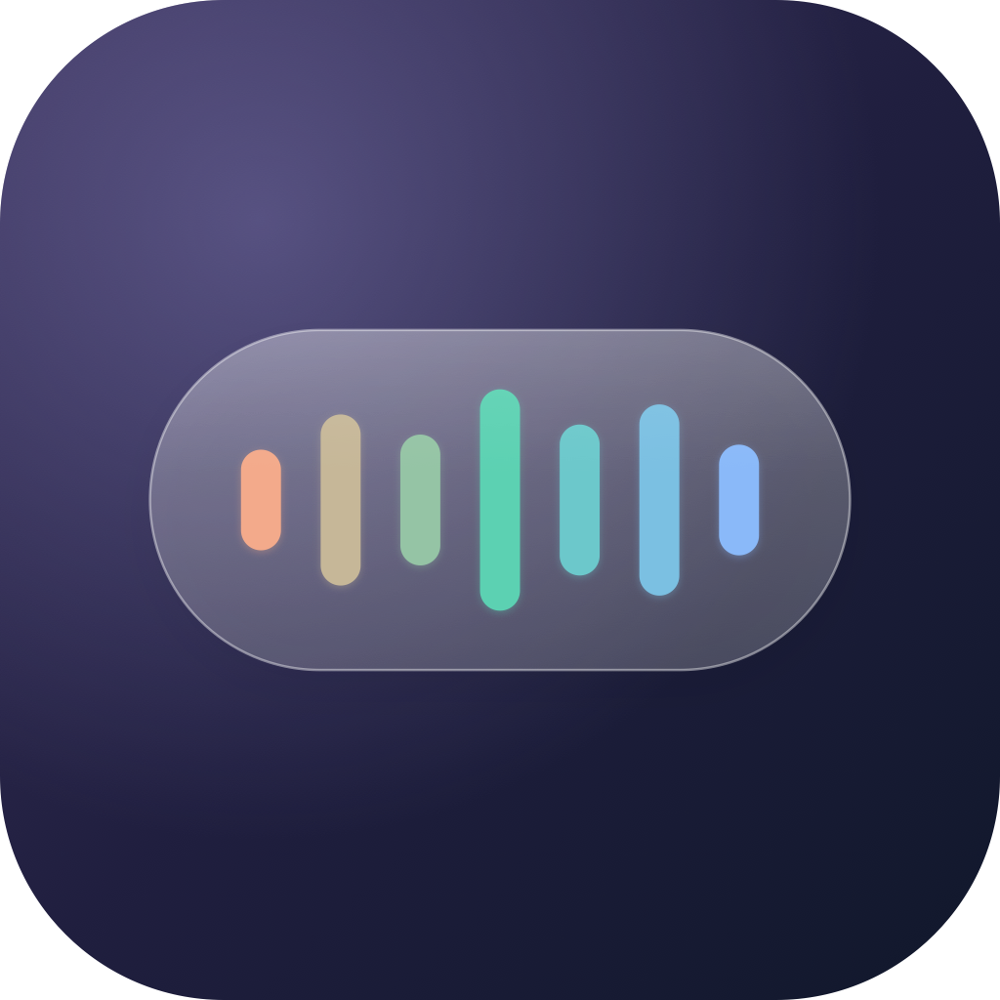
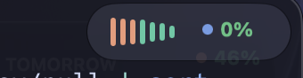
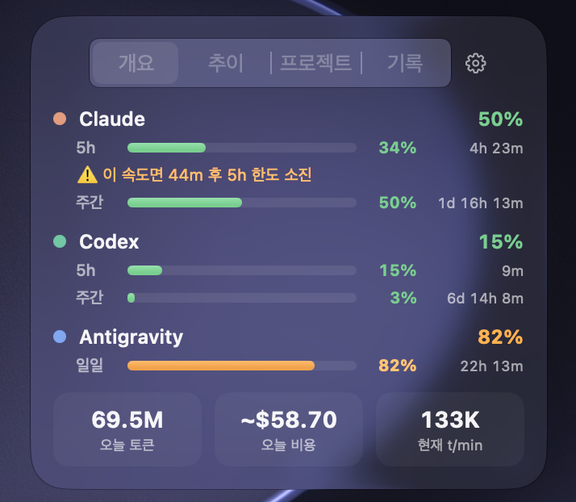
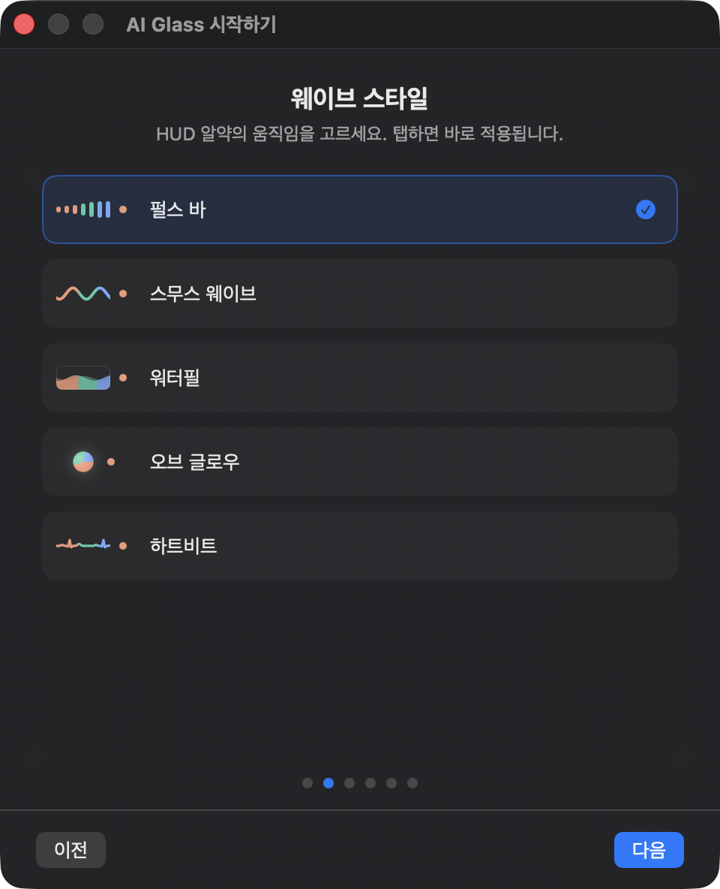

<p align="center">
  
</p>

<h1 align="center">AI Glass</h1>

<p align="center">
  Claude Code · Codex · Antigravity 사용량을 <b>liquid glass</b>로 보여주는 macOS 메뉴바 앱
</p>

<p align="center">
  <a href="https://github.com/taeng0204/ai-glass/releases"></a>
  
  
  <a href="LICENSE"></a>
</p>

<p align="center">
  
</p>

화면 우상단에 항상 떠 있는 **펄스 웨이브 알약**이 AI 코딩 에이전트들의 토큰 소모를 실시간으로 보여줍니다. 토큰이 빨리 탈수록 파도가 크게 출렁이고, 색 띠는 지금 어떤 에이전트가 일하는지 알려줍니다. 한도가 임박하면 알약이 카드로 모핑되며 경고하고, 새 세션이 시작되면 지난 세션을 요약해줍니다.

## 설치 (원클릭)

```bash
curl -fsSL https://raw.githubusercontent.com/taeng0204/ai-glass/main/install.sh | bash
```

최신 릴리스를 받아 `/Applications`에 설치하고 바로 실행합니다. 또는 [Releases](https://github.com/taeng0204/ai-glass/releases)에서 zip을 직접 받아 `/Applications`에 넣어도 됩니다 (이 경우 최초 실행은 **우클릭 → 열기** — ad-hoc 서명 빌드라 Gatekeeper 확인이 한 번 필요합니다).

> 요구사항: **macOS 26 (Tahoe) 이상** — 네이티브 liquid glass API를 사용합니다. Claude Code / Codex / Antigravity 중 1개 이상 사용 이력이 있으면 됩니다.

## 기능

| | |
|---|---|
| **플로팅 HUD** | 우상단 glass 알약 — 웨이브 스타일 5종(펄스 바/스무스 웨이브/워터필/오브/심전도), 6초 서비스 로테이션, 호버 시 에이전트별 5h·주간 게이지+리셋 카운트다운, 드래그 이동, ⌘⇧E 고정 확장 |
| **대시보드** | 메뉴바 ✦ 클릭 또는 ⌘⇧U — 개요(윈도우별 게이지·소진 예측·오늘 토큰/비용/속도) · 추이(7/30일 스택 차트) · 프로젝트(디렉토리별, 에이전트 색 구분) · 기록(알림 히스토리, 호버 시 알약 리플레이) |
| **이벤트** | 한도 70/90% 임박 · 세션 리셋(직전 세션 요약) · 토큰 급증 · 소진 예측(5h는 세션 내 소진 시, 주간은 "~N일" 추세) · 복귀 인사 |
| **브리핑** | 아침(어제 요약+스트릭 🔥) · 점심(오늘 페이스 예측) · 저녁(오늘 요약) · 월요일 주간 리포트 📊 |
| **재미** | 마일스톤 돌파 🎉 · 일일 신기록 🏆 · 사운드(옵션) — 통계도 중요하지만 감성도 중요하니까 |
| **온보딩** | 첫 실행 시 웨이브 스타일·메뉴바 모드·에이전트를 라이브 프리뷰로 선택 |

<p align="center">
  
</p>

<p align="center">
  
</p>

## 데이터 소스 & 프라이버시

모든 처리는 **로컬**에서 이루어집니다. 외부 네트워크 요청은 Claude 한도 조회용 Anthropic 사용량 API 호출 단 하나이며, 텔레메트리는 없습니다.

- **Claude**: `~/.claude/projects/**/*.jsonl` (토큰·모델·프로젝트) + Keychain OAuth → 사용량 API (정확한 5h/주간 %) — 최초 1회 Keychain 다이얼로그에서 **"항상 허용"** 권장
- **Codex**: `~/.codex/sessions/**/*.jsonl` (rate limit 스냅샷 + 토큰 + 프로젝트)
- **Antigravity**: `~/.gemini/antigravity-cli/history.jsonl` (일일 요청 수 추정 — 토큰 정보는 로그에 없음)
- 일별 통계는 `~/Library/Application Support/AIGlass/stats.db` (SQLite)에 저장

비용 표시는 **API 단가 환산 추정치**입니다 — 구독 플랜 실비가 아닙니다.

## 소스에서 빌드

```bash
git clone https://github.com/taeng0204/ai-glass.git && cd ai-glass
swift test                 # 단위 테스트 (136개)
swift run AIGlass          # 개발 실행 (자동시작·알림은 .app 번들 전용)
bash Scripts/make-app.sh   # .app 번들 생성 → build/AIGlass.app
swift run AIGlass --check-claude   # Claude 한도 API 연결 진단
```

> ad-hoc 서명이라 재빌드 시 Keychain 허용을 다시 묻습니다 (Apple Developer 인증서 없이는 피할 수 없는 macOS 정책).

## 단축키

- **⌘⇧U** — 대시보드 열기/닫기
- **⌘⇧E** — 알약 확장 고정/해제

## 라이선스

[MIT](LICENSE) © 2026 taeng0204
